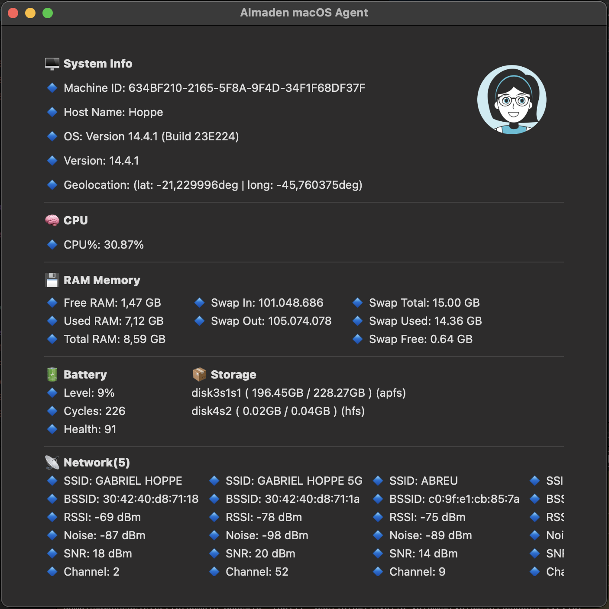

## 📈 macOS Stats

A macOS monitoring tool that collects and displays detailed system information, resource usage, and hardware activity in real time.

This project was developed as a **Minimum Viable Product (MVP)** for a system monitoring agent by [Almaden LTDA](https://almaden.ai/).  
It utilizes native macOS APIs such as `sysctl`, `host_info`, and `IOKit` to collect low-level and high-level system data efficiently.

  

---

## 🔍 Data

### 🖥️ System Info

| Field       | Description                   |
|-------------|-------------------------------|
| Machine ID  | Unique identifier of the Mac  |
| Host Name   | Local host name of the machine |
| OS          | Operating System name         |
| OS Version  | Version of macOS              |

---

### 🧠 RAM Memory Consumption

| Field            | Description                           |
|------------------|---------------------------------------|
| Free RAM         | Amount of unused RAM (GB)             |
| Used RAM         | Amount of used RAM (GB)               |
| Total RAM        | Total physical memory (GB)            |
| Swap In          | Number of swap-in operations          |
| Swap Out         | Number of swap-out operations         |
| Swap Total (GB)  | Total swap space available (GB)       |
| Swap Used (GB)   | Currently used swap space (GB)        |
| Swap Free (GB)   | Available swap space (GB)             |

---

### 💾 Storage Consumption

| Field        | Description                            |
|--------------|----------------------------------------|
| Storage Name | Volume or disk name                    |
| Free         | Free storage space (GB)                |
| Used         | Used storage space (GB)                |
| Total        | Total storage capacity (GB)            |
| File Type    | File system type (e.g., APFS, HFS+)     |

---

### 🧮 CPU Consumption

| Field | Description                      |
|-------|----------------------------------|
| %CPU  | Overall CPU usage percentage     |

---

### 🔋 Battery Info

| Field   | Description                         |
|---------|-------------------------------------|
| Level   | Battery charge level (%)            |
| Cycles  | Number of charge cycles             |
| Health  | Battery health (Normal/Service etc) |

---

### 📶 Nearby Wi-Fi Networks

| Field         | Description                            |
|---------------|----------------------------------------|
| SSID          | Network name                           |
| BSSID         | MAC address of access point            |
| RSSI          | Signal strength (dBm)                  |
| Noise         | Noise level (dBm)                      |
| SNR           | Signal-to-noise ratio                  |
| Channel       | Wi-Fi channel                          |
| Channel Band  | Frequency band (e.g., 2.4 GHz, 5 GHz)  |
| Channel Width | Width of the Wi-Fi channel             |
| Connected     | Whether currently connected (Yes/No)   |

---

### 🌐 Network Interfaces

| Field         | Description                      |
|---------------|----------------------------------|
| Name          | Interface name (e.g., en0, en1)  |
| IPV4          | IPv4 address                     |
| IPV6          | IPv6 address                     |
| MAC           | MAC address                      |
| Net Mask      | Subnet mask                      |
| Current Speed | Connection speed (e.g., Mbps)    |

---

### ⚙️ Running Processes Consumption

| Field               | Description                              |
|---------------------|------------------------------------------|
| PID                 | Process ID                               |
| Name                | Name of the process                      |
| App ID              | Application identifier (if available)    |
| CPU% Single Core    | CPU usage per core (%)                   |
| CPU% Multi Core     | Total CPU usage across cores (%)         |
| Physical Memory     | Memory usage (MB or GB)                  |
| Physical% Memory    | Percentage of total RAM used             |

---

### 🧩 Installed Applications

| Field                          | Description                                      |
|--------------------------------|--------------------------------------------------|
| Name                           | Application name                                |
| Scope                          | Scope: SYSTEM / SHARED / USER                   |
| Executable Name                | Name of the binary executable                   |
| Bundle ID                      | Unique bundle identifier                        |
| Bundle Name                    | Name defined in the app bundle                  |
| Bundle Display Name            | Display name of the application                 |
| Bundle Version                 | Version number                                  |
| Bundle Minimum System Version | Minimum macOS version required                  |
| Bundle Path                    | Full path to the application bundle             |

---

### 🔌 USB Events

| Field         | Description                                   |
|---------------|-----------------------------------------------|
| Type          | Event type: CONNECTED or EJECTED             |
| Product Name  | Name of the USB device                        |
| Vendor Name   | Manufacturer of the USB device                |
| Serial Number | Device serial number                          |
| Speed         | Connection speed (e.g., USB 2.0, 3.0, 3.1)    |
